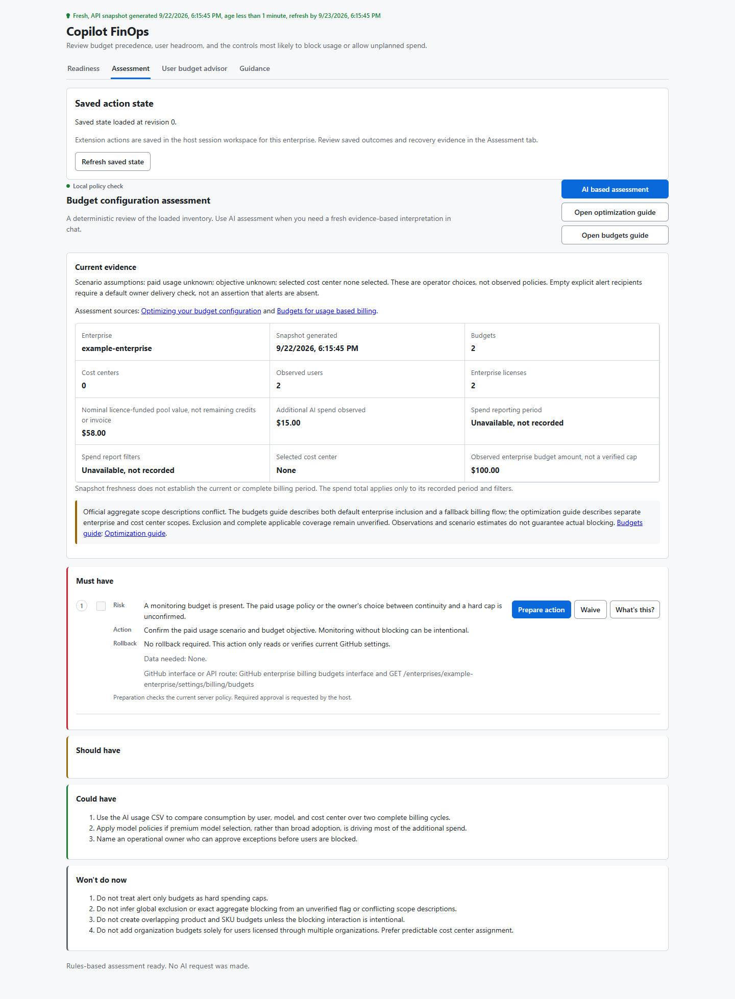

# Copilot FinOps canvas

Review GitHub Copilot budgets and estimate spending in a canvas. This standalone marketplace contains one plugin, `github-ai-budget-canvas`.

**Experimental:** a compatible graphical Copilot host is required. A native plugin canvas and installation on a second Windows machine remain unverified. No minimum supported graphical host version has been established.

## Install on Windows

Use PowerShell with Git and GitHub Copilot CLI on `PATH`. Use your own authorised Copilot account. Your organisation must permit this marketplace and plugin; public repository access does not grant that permission.

Run these commands in order, stopping if any command fails:

```powershell
copilot --version
copilot plugin marketplace add "anarchitect/copilot-finops-canvas#v1.0.0-experimental.1"
copilot plugin marketplace list --json
copilot plugin marketplace browse copilot-finops --json
copilot plugin install github-ai-budget-canvas@copilot-finops
copilot plugin list --json
```

The marketplace name is `copilot-finops`, from its manifest. The installed entry should show `github-ai-budget-canvas`, version `1.0.0-experimental.1`, enabled and sourced from that marketplace. Stop on a version mismatch or policy denial. Do not switch to somebody else's credentials or bypass managed settings.

If the marketplace is already registered, check its existing source with `copilot plugin marketplace list --json` before using the rerun steps. Adding the same marketplace again is refused; do not overwrite an unfamiliar registration.

The package is already materialized in Agent Plugins 1.0 format. No source build, separate installer or copied user extension is needed.

## Open the canvas

In a graphical host that supports installed plugin canvases, start a new empty session and confirm the provider belongs to the installed `github-ai-budget-canvas` plugin. Its entry point is under `com.github.copilot\extensions\github-ai-budget-canvas`.

Ask the agent:

> Open Copilot FinOps canvas, canvas ID `github-ai-budget-canvas`, for `example-enterprise` with `credentialMode` set to `gh`. Do not run readiness, Inventory, AI assessment or any budget action.

`example-enterprise` is fictional and lets you check the neutral panel without collecting live inventory. For real use, open a new instance with your own enterprise slug. Existing instances cannot be retargeted.

If the host cannot discover the plugin provider or open its panel, stop and record the client version and error. CLI installation does not prove graphical host support. Do not substitute a user or project extension and count that as a plugin test.

GitHub CLI authentication is needed for real reads when using `credentialMode: gh`. Sign in with your own approved account. The canvas refuses that mode if an environment token would override the selected GitHub CLI account. Do not copy tokens or account settings between machines.

## Rerun or refresh this version

Reinstalling the named plugin is safe to repeat:

```powershell
copilot plugin install github-ai-budget-canvas@copilot-finops
copilot plugin marketplace update copilot-finops
copilot plugin update github-ai-budget-canvas@copilot-finops
copilot plugin list --json
```

These commands retain the marketplace's registered release pin. They do not select a newer release. To change versions, first follow the removal steps below, then register the newly reviewed release tag and install the plugin again.

## Behaviour and limits

The package starts with neutral data. The preview below uses fictional users and budgets.



The calculator and local assessment are deterministic. Inventory and AI assessment requests use the active Copilot chat and may consume AI credits. An acknowledgement means the request was queued, not completed. Inventory completion must come from saved verified state; AI assessment output belongs in chat.

Estimates are not invoices or a verified effective allowance. Unknown usage is not zero. Permission limits can hide budgets or assignments, and overlapping controls may leave enforcement uncertain. Check GitHub's current billing pages and APIs before making financial decisions.

Production checks establish visible budget read access only. They do not prove complete visibility, write authority or an authenticated browser driver, so writes remain unavailable by default. A supported write requires native host confirmation, a bound audit and an independent check of the result. An agent's success message cannot establish completion.

Inventory and action state stay in the host session workspace. The shared dispatch journal prevents another enterprise panel from bypassing an unresolved operation. Closing a panel does not cancel queued work, and reopening does not resend it. Corrupt or inaccessible state is reported rather than replaced with empty data.

## Remove the plugin and marketplace

Let queued work finish, reconcile uncertain operations and close the panel before removal. Uninstalling does not cancel dispatched work, delete saved session data or change GitHub budgets.

```powershell
copilot plugin uninstall github-ai-budget-canvas@copilot-finops
copilot plugin list --json
copilot plugin marketplace remove copilot-finops
copilot plugin marketplace list --json
```

Always uninstall the named plugin before removing its marketplace. Do not rely on marketplace removal to clean up an enabled plugin, and do not use `--force`. Preserve saved state and recovery evidence until all operations have known outcomes. Never delete an active dispatch journal to enable another attempt.

## Version integrity

The release version is `1.0.0-experimental.1`; its tag is `v1.0.0-experimental.1`. Published release tags will not be moved. Any change to package bytes or release metadata requires a new version and tag. For a stronger pin, use an independently reviewed full commit ID after `#` instead of a tag.

[`checksums.json`](checksums.json) lists the size and SHA256 of every repository file except itself. Paths are relative to the repository root. The file records integrity, not publisher authenticity; compare it with a trusted release. `.gitattributes` disables line ending conversion so Windows checkouts retain the recorded bytes.

## Licence and references

Original code is [MIT licensed](plugins/github-ai-budget-canvas/com.github.copilot/extensions/github-ai-budget-canvas/LICENSE), copyright `anarchitect`. The bundled GitHub Docs articles have separate [CC BY 4.0 terms](plugins/github-ai-budget-canvas/com.github.copilot/extensions/github-ai-budget-canvas/licenses/CC-BY-4.0.txt) and [attribution](plugins/github-ai-budget-canvas/com.github.copilot/extensions/github-ai-budget-canvas/NOTICE). The MIT licence does not relicense those articles.

See GitHub's [marketplace guide](https://docs.github.com/en/copilot/how-tos/copilot-cli/customize-copilot/plugins-marketplace), [plugin reference](https://docs.github.com/en/copilot/reference/copilot-cli-reference/cli-plugin-reference), [budget documentation](https://docs.github.com/en/enterprise-cloud@latest/copilot/concepts/billing-and-usage/organizations-and-enterprises/budgets) and [budget optimisation guide](https://docs.github.com/en/copilot/tutorials/budgets/optimizing-your-budget-configuration).
