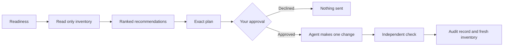

# Copilot FinOps canvas

A GitHub Copilot app canvas for GitHub Enterprise administrators. It reads your Copilot budgets and usage, ranks what needs attention and shows how to act on each finding. For the one change it supports, it prepares an exact plan for your approval and checks the result independently. Live changes stay locked in this experimental release, as [Human in the loop](#human-in-the-loop) explains.


*Preview with fictional users and budgets.*

## The problem

Under usage based billing, every Copilot licence adds AI credits to a pool shared across the enterprise. Usage beyond the pool is billed as additional spend. Budgets at the user, organisation, cost centre and enterprise levels work together, each with its own alerts and optional hard stop. It is hard to see the combined effect, to tell which gaps matter and to change a setting without surprising developers.

## What it does

1. **Readiness** checks GitHub CLI, the signed in account and access to the visible budget collection. It does not verify complete billing coverage.
2. **Inventory** asks the Copilot chat agent to read budgets and usage with read only GitHub API calls. The canvas then checks the budget collection itself.
3. **Assessment** ranks findings as Must, Should, Could and Won't now. Each finding shows its risk, the proposed action and how to roll it back.
4. **User budget advisor** shows the budgets that apply to one user and whether their effective allowance can be verified.
5. **Guidance** keeps the relevant GitHub Docs articles next to the evidence.
6. **Act** turns the one supported change into an exact plan, asks for your approval in the app, sends it to the agent and verifies the result. Live writes stay locked in this release.



## Roles

| Role | Responsibility |
| --- | --- |
| Enterprise owner or billing manager | Signs in with their own account, reviews the evidence, decides on each recommendation and approves or declines the supported change. Has the widest view of enterprise budgets. |
| Organisation administrator | Can run the read only scan for an organisation. Sees a narrower set of budgets, so enterprise wide coverage cannot be established. |
| Copilot chat agent | Runs read only GitHub API calls, carries out one approved change exactly as planned and returns an audit record. It cannot mark its own work complete. |
| Canvas | Shows evidence and recommendations, prepares exact plans, blocks conflicting work and checks results independently. It runs GitHub CLI with the administrator's own credentials and has no field for entering a token. |
| Adviser (optional) | A solution architect or partner can run the read only scan alongside the customer. The customer signs in with their own account, so the adviser never needs customer credentials. |

## Prerequisites

* A GitHub enterprise with Copilot Business or Copilot Enterprise licences on usage based billing.
* Enterprise owner or billing manager access for the widest budget view. Organisation administrators get a narrower view.
* GitHub CLI (`gh`) signed in with your own approved account. Copilot sign in alone does not grant billing access.
* For the read only scan: a private chat in the GitHub Copilot app. Nothing to install.
* For the canvas: Windows PowerShell with Git and GitHub Copilot CLI on `PATH`, a graphical Copilot host that supports plugin canvases, and an organisation policy that permits this marketplace and plugin. Public repository access does not grant that permission.

## Quick start

### Option 1: scan without installing anything

The fallback reads your actual Copilot budgets, alert settings and available usage, then returns an evidence table and recommendations in private chat. It works when the canvas is unavailable or disabled. It does not install, enable or repair the canvas, and does not change GitHub settings.

**Paste a prompt.** Open [the standalone prompt](.github/prompts/copilot-finops-fallback.prompt.md). Copy everything below its YAML frontmatter (the second `---`) into a private Copilot app chat. Replace `ENTERPRISE` with your enterprise slug and send it. The `.prompt.md` location is standard for supported IDEs; in the Copilot app, paste the text rather than relying on prompt slash commands.

**Or reuse the skill.** The skill is [`.github/skills/copilot-finops-fallback/SKILL.md`](.github/skills/copilot-finops-fallback/SKILL.md). Open this repository in the Copilot app, or copy the skill to your personal skills folder (by default `%USERPROFILE%\.copilot\skills\copilot-finops-fallback\SKILL.md` on Windows) after confirming that app instance's skills location. Check **Customize > Skills** to confirm it was discovered, then run:

```text
Use /copilot-finops-fallback to scan enterprise ENTERPRISE. Keep the report in this private chat.
```

The default is an inventory for the current UTC month, not a request to change budgets. For an organisation, say `scan organisation ORGANISATION`. To guide the recommendations, add `My goal is monitoring` or `My goal is a hard spending cap`. Results stay in chat unless you choose a private local Markdown path outside repository checkouts and shared folders. Never save tenant reports in this public repository.

### Option 2: install the canvas (experimental)

```powershell
copilot plugin marketplace add "anarchitect/copilot-finops-canvas#v1.0.0-experimental.1"
copilot plugin install github-ai-budget-canvas@copilot-finops
copilot plugin list --json
```

Then, in a new session of a graphical host that supports plugin canvases, ask:

> Open Copilot FinOps canvas, canvas ID `github-ai-budget-canvas`, for `example-enterprise` with `credentialMode` set to `gh`. Do not run readiness, Inventory, AI assessment or any budget action.

`example-enterprise` is fictional and opens the neutral panel. For real use, open a new instance with your own enterprise slug. The [release instructions](https://github.com/anarchitect/copilot-finops-canvas/tree/v1.0.0-experimental.1#install-on-windows) cover the full checks, rerun, removal and version integrity steps.

## Governance and data boundaries

* Reads run through GitHub CLI with the administrator's own credentials. With `credentialMode` set to `gh`, as in the quick start, the canvas stops if an environment token would override the stored sign in.
* Inventory tells the agent to use read only API calls. The canvas checks budget pagination itself, labels partial data as partial and never treats unknown usage as zero.
* An inventory starts expiring after 20 hours and is stale after 24. Facts confirmed only in the GitHub UI are valid for 30 days. Stale or mismatched facts count as unknown.
* Inventory and action state stay in the host session workspace, and fallback results stay in the private chat. Nothing is written to this repository.
* The calculator and local assessment are deterministic. Inventory and AI assessment run in the active Copilot chat and may consume AI credits.
* The canvas parses the agent's inventory file as data, checks its schema, enterprise and shape, and escapes names and text from GitHub before showing them.
* Writes fail closed, as the next section explains.

## Human in the loop

1. Most recommendations need a business decision. The canvas explains them and shows the route, but does not change them.
2. Before a Should action can proceed, any related Must action has to be resolved or waived. A waiver needs a written reason and is recorded as a decision, not as completion.
3. The one supported change, turning on the hard stop for an existing enterprise Copilot budget, is prepared as an exact plan bound to the current inventory, account and budget.
4. Before anything is sent, the canvas reads the budget again. If it has changed, you must prepare a new plan.
5. The Copilot app shows a native approval dialog with the enterprise, account, budget, current and requested values, and a note that there is no automatic rollback or retry. Declining sends nothing.
6. Only one operation can be in flight. An unresolved operation blocks the next one, even from another canvas panel.
7. The agent makes the change and returns an audit record. Its reply cannot mark the work complete. Only an independent read of GitHub can do that. An uncertain outcome must be reconciled, never repeated.
8. After a change, Inventory must run again before new recommendations are trusted.

In this release, read access can be proven but write permission cannot, so live writes stay blocked. Administrators make the change in GitHub's billing settings, then run Inventory again. Automated tests and the demo run the approval and verification path above with simulated write permission.

## Success measures

* Every visible budget inventoried with complete pages and evidence less than 24 hours old.
* Open Must findings resolved, or waived with a written reason, within an agreed review cycle.
* Additional spend each billing cycle stays within the budget the enterprise chose, with no unplanned overage.
* Any completed change has an approval, an audit record and an independent check, and none is repeated after an uncertain result.
* Fewer surprise blocks for developers, measured through support requests after budget changes.

## Status and evidence

* Release `1.0.0-experimental.1` is published as the tag [`v1.0.0-experimental.1`](https://github.com/anarchitect/copilot-finops-canvas/tree/v1.0.0-experimental.1). The tag's `checksums.json` lists the size and SHA256 of every file in that release.
* Tested on Windows during development: 456 automated tests and 7 headless browser scenarios passed on 9 October 2026, all with synthetic data. The tested code matches this release apart from line endings. The test suite is kept in the private development repository.
* Not yet verified: canvas discovery after a marketplace install in a graphical host, a second Windows machine and a minimum host version. If the canvas does not open, use the read only scan.

## How it was built

Development started in an empty private repository on 21 September 2026. The first commit, written with the GitHub Copilot app, was a single page HTML budget canvas and a recommendations note.

* From 21 to 23 September 2026, 66 commits on the release branch added readiness checks, the read only inventory, the ranked assessment, the user budget advisor, the guidance tab, the approval and dispatch journal, independent verification and audit, crash safe local state, a synthetic test harness and packaging as a Copilot plugin marketplace.
* The release was published here as one commit. The read only fallback skill and prompt came later, in pull request 6.
* Git records the GitHub Copilot app as co-author of every development commit except one pull request merge, and of the release and fallback commits in this repository.
* All code was written for this project. The canvas has no third party runtime dependencies and uses only Node.js built in modules. Development tests use `playwright-core` (Apache 2.0), which is not shipped.
* Two GitHub Docs articles on budgets are bundled unchanged under CC BY 4.0, with attribution in the release's [NOTICE](https://github.com/anarchitect/copilot-finops-canvas/blob/v1.0.0-experimental.1/plugins/github-ai-budget-canvas/com.github.copilot/extensions/github-ai-budget-canvas/NOTICE).

## Why GitHub Copilot

* The canvas sits beside the chat agent that does the work, so evidence, decision and action stay in one place.
* The app's native confirmation dialog asks the administrator to approve the supported change before it is sent.
* GitHub CLI runs with the administrator's own credentials, so the canvas needs no separate service account.
* The read only scan also ships as a skill and a prompt, so it works in Copilot chat without the canvas.

## Licence

Original code is [MIT licensed](https://github.com/anarchitect/copilot-finops-canvas/blob/v1.0.0-experimental.1/plugins/github-ai-budget-canvas/com.github.copilot/extensions/github-ai-budget-canvas/LICENSE), copyright `anarchitect`. The bundled GitHub Docs articles keep their [CC BY 4.0 terms](https://github.com/anarchitect/copilot-finops-canvas/blob/v1.0.0-experimental.1/plugins/github-ai-budget-canvas/com.github.copilot/extensions/github-ai-budget-canvas/licenses/CC-BY-4.0.txt); the MIT licence does not relicense them.

<details>
<summary>Synthetic result example from the read only scan</summary>

All identifiers, settings and times below are fictional. This is an example of the report format, not a live scan.

Scan: `2026-09-24T00:00:00Z`. Target: `example-enterprise`. Goal: monitoring. Synthetic responses contain two budgets in two pages with a stable total of two. A fictional billing UI observation independently confirmed USD amounts and the current monthly cycle for `demo-1`; those meanings are not inferred from a retrieval timestamp.

| Budget ID / observed entity | Scope | Product / type | Limit and period | Alerts | Stop usage | Consumption / observed headroom | Evidence |
| --- | --- | --- | --- | --- | --- | --- | --- |
| `demo-1` / enterprise; no display name returned | `enterprise` | `ai_credits` / `BundlePricing` | USD 100, current monthly cycle | Enabled; zero additional recipients returned; delivery unverified | `false`, monitoring only | USD 30 / USD 70, for this budget only | Budget page 1, `budget_amount`, `consumed_amount`, `budget_alerting`, `prevent_further_usage`; fictional UI unit/period check |
| `demo-2` / `sample-person` | `user` | `ai_credits` / `BundlePricing` | USD 20 per month, documented interpretation | Disabled in returned record | `true`, user budget hard stop documented | Unknown / unknown | Budget page 2; `consumed_amount` absent |

The budget API does not return threshold percentages. The documented 75%, 90% and 100% alert thresholds are guidance, not independently observed settings. Zero additional recipients does not prove that default owners receive no alerts.

| Source | Status and coverage |
| --- | --- |
| Budgets | Two of two visible records retrieved; account wide visibility still unverified |
| Cost centers | Forbidden; assignments, included usage controls and exclusions unknown |
| AI credit usage | Not available; shared pool balance and additional spend unknown |
| Native canvas | Explicitly disabled; not opened or changed |

**Proposals:** Keep monitoring as the stated goal; have the billing owner confirm alert delivery. Resolve cost center visibility before assessing combined controls. Do not infer the individual's remaining allowance from the enterprise's USD 70 headroom.

Read only scan; no GitHub settings changed.

</details>

## References

GitHub's [budget documentation](https://docs.github.com/en/enterprise-cloud@latest/copilot/concepts/billing-and-usage/organizations-and-enterprises/budgets), [budget optimisation guide](https://docs.github.com/en/copilot/tutorials/budgets/optimizing-your-budget-configuration), [agent skills format](https://docs.github.com/en/copilot/how-tos/copilot-cli/customize-copilot/add-skills), [Copilot app customisation](https://docs.github.com/en/copilot/how-tos/github-copilot-app/customize-github-copilot-app), [prompt file format](https://docs.github.com/en/copilot/tutorials/customization-library/prompt-files/your-first-prompt-file), [plugin marketplace guide](https://docs.github.com/en/copilot/how-tos/copilot-cli/customize-copilot/plugins-marketplace) and [plugin reference](https://docs.github.com/en/copilot/reference/copilot-cli-reference/cli-plugin-reference).
